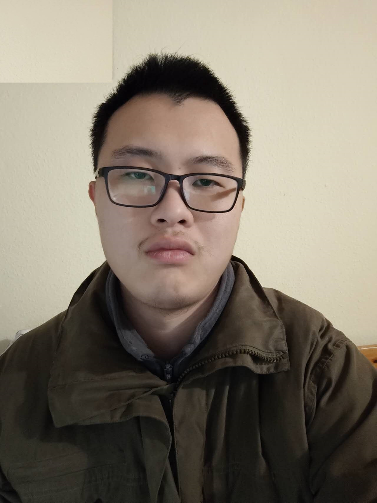

Welcome to Heyang Li's personal webpage
    

I am a research assitant in the <a href="https://arg.cs.rptu.de/en">automated reasoning group</a> at RPTU Kaiserslautern, under the supervision of Prof. Anthony. W. Lin. I obtained my bachelor 
    degree in China, and I finished my master study in Saarland University.     

My current research interests lie in improve the <a href="https://en.wikipedia.org/wiki/Graph_Query_Language">graph query language</a>, and I am specifal focusing on 
    regular path queries on property graphs</a>    
    
    
    
You may contact me at heyangli4work at gmail dot com.
